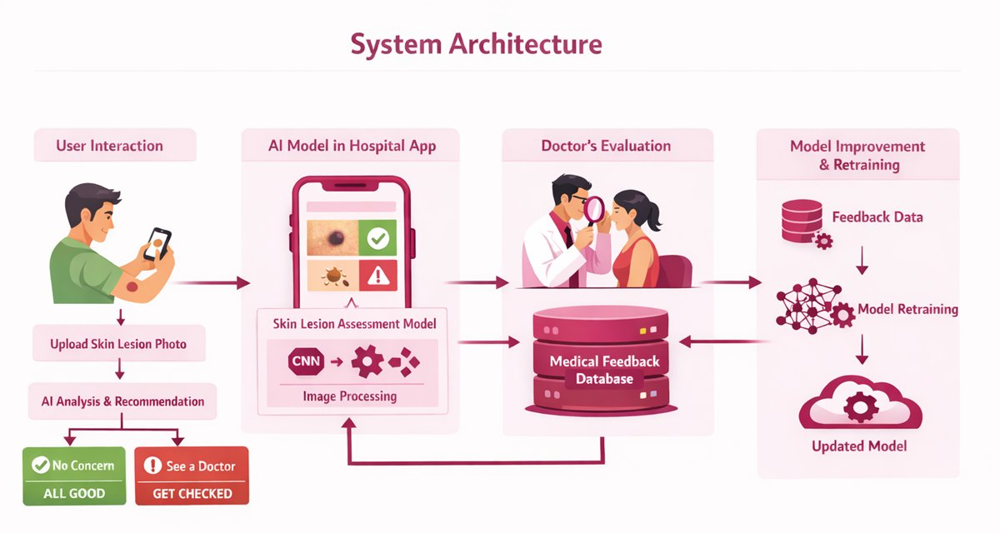
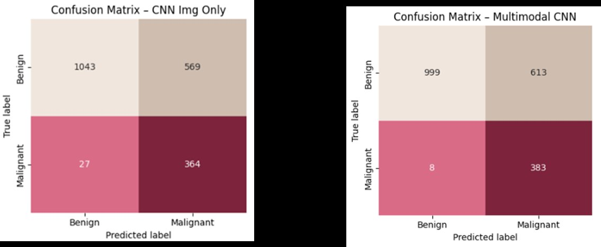
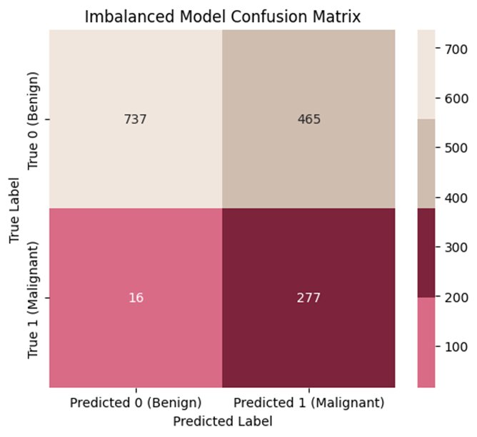

# 🔬 Skin Cancer Detection — CNN-Based Image Classification

> Sistema de detección temprana de cáncer de piel mediante redes neuronales convolucionales (CNN) sobre el dataset HAM10000, orientado a un contexto mobile-first para Uruguay.

**Autoras:** Leticia Colombo · Jeasmine Ñahui  
**Programa:** MISTI GTL — AI Uruguay, 2026

---

## 📋 Tabla de Contenidos

- [Motivación y Contexto](#motivación-y-contexto)
- [Objetivo](#objetivo)
- [Estructura del Proyecto](#estructura-del-proyecto)
- [Dataset](#dataset)
- [Análisis Exploratorio (EDA)](#análisis-exploratorio-eda)
- [Modelos](#modelos)
- [Resultados](#resultados)
- [Discusión y Trabajo Futuro](#discusión-y-trabajo-futuro)
- [Requisitos](#requisitos)

---

## 🇺🇾 Motivación y Contexto

Uruguay presenta la **tasa más alta de cáncer de piel en América Latina**, con aproximadamente 3.100 casos por año, representando el 19% de todos los diagnósticos oncológicos anuales. A pesar de esto, la mayoría de las personas no revisa regularmente sus lesiones cutáneas.

El tratamiento del cáncer de piel avanzado puede costar **hasta 50 veces más** que su detección temprana. Este proyecto apunta a construir un sistema de soporte a la detección temprana, escalable y accesible vía dispositivo móvil.

> *"This is AI designed not to replace doctors, but to save lives and reduce healthcare spending by preventing advanced disease."*

---

## 🎯 Objetivo

Desarrollar un clasificador binario de lesiones cutáneas (**benigno vs. maligno**) basado en imágenes dermatoscópicas, evaluando múltiples arquitecturas CNN para maximizar la detección de casos malignos (Recall).

---

## 🏗️ Arquitectura del Sistema



El flujo completo contempla cuatro etapas: el usuario sube una foto de su lesión desde la app móvil → el modelo CNN la analiza y emite una recomendación (sin riesgo / consultar médico) → un dermatólogo puede revisar el caso y aportar feedback → ese feedback retroalimenta el reentrenamiento del modelo.

---

## 📁 Estructura del Proyecto

```
├── Skin_Cancer_Detection_-_EDA.ipynb                  # Análisis exploratorio del dataset HAM10000
├── Skin_Cancer_Detection_-_Zero_Model_Img.ipynb       # CNN desde cero con imágenes
├── Skin_Cancer_Detection_-_Zero_Model_Img___tabular.ipynb  # CNN multimodal (imágenes + datos tabulares)
├── Skin_Cancer_Detection_-_TLM.ipynb                  # Transfer Learning con MobileNetV2
└── Skin_Cancer_Detection.pptx                         # Presentación del proyecto
```

---

## 📊 Dataset

**HAM10000** (*Human Against Machine with 10000 training images*) es un dataset público de imágenes dermatoscópicas ampliamente utilizado en investigación clínica.

- **10.015 imágenes** de lesiones pigmentadas recopiladas durante 20 años
- Dos centros clínicos independientes: Medical University of Vienna (Austria) y práctica dermatológica de Cliff Rosendahl (Queensland, Australia)
- **Columnas:** `image_id`, `lesion_id`, `dx` (diagnóstico), `dx_type`, `age`, `sex`, `localization`

### Tipos de lesiones

| Tipo | Código | Conteo | Etiqueta | Características |
|---|---|---|---|---|
| Melanocytic nevi | `nv` | 6.705 | **Benigno** | Lunares comunes; clase mayoritaria |
| Melanoma | `mel` | 1.113 | **Maligno** | Cáncer agresivo; detección temprana crítica |
| Benign keratosis-like | `bkl` | 1.099 | **Benigno** | Queratosis seborreica; visualmente variable |
| Basal cell carcinoma | `bcc` | 514 | **Maligno** | Cáncer más común; crecimiento lento |
| Actinic keratoses | `akiec` | 327 | **Maligno*** | Lesiones premalignas inducidas por el sol |
| Vascular lesions | `vasc` | 142 | **Benigno** | Lesiones de origen vascular |
| Dermatofibroma | `df` | 115 | **Benigno** | Lesiones fibrosas benignas |

> ⚠️ **Dataset fuertemente desbalanceado:** las lesiones benignas representan ~80% del total, dominado por melanocytic nevi (~67%). Esto requiere estrategias específicas de manejo del desbalance durante el entrenamiento.

### Preprocesamiento de imágenes

- Carga desde disco, conversión a RGB
- Redimensionado a **100×75 píxeles**
- Normalización al rango **[0, 1]**
- Features tabulares (`age`, `sex`, `localization`): imputación de `age` por mediana; `sex` imputado por moda según combinación de `localization` e `is_malignant`; variables categóricas con one-hot encoding
- Eliminación de 47 filas (0.47%) donde `age` era nulo y `sex` era 'unknown' simultáneamente

---

## 🔍 Análisis Exploratorio (EDA)

### Calidad de datos

- 57 valores nulos en `age` (tratados por imputación o eliminación según contexto)
- Entradas 'unknown' en `sex` y `localization`, imputadas por moda estratificada
- 2 conjuntos de imágenes duplicadas detectadas por hashing MD5

### Hallazgos principales

**Distribución de clases:**
- Las lesiones benignas (~80%) dominan el dataset, impulsadas por melanocytic nevi (6.705 casos). Este desbalance severo es la principal consideración técnica del proyecto.

**Métodos de confirmación diagnóstica:**
- Histopatología (*hist*): gold standard diagnóstico
- Microscopía confocal (*confocal*): imagen no invasiva de alta resolución
- Consenso clínico (*consensus*)
- Seguimiento clínico (*follow-up*)

**Features de imagen analizados:**
- **Dullness** (opacidad): valores altos indican lesiones con menor saturación y brillo; más frecuente en lesiones malignas
- **Whiteness** (luminosidad): valores altos en lesiones muy claras; generalmente bajos en melanomas (más oscuros/pardos), con excepciones en algunos subtipos malignos
- **Blurriness** (nitidez): mide el desenfoque de la imagen; relevante para filtrado de calidad

**Distribución anatómica de lesiones malignas:**
- Mayor concentración en tronco, espalda y extremidades inferiores; distribución variable según tipo de lesión maligna

**Correlaciones:**
- Age, sex y localization muestran patrones específicos que pueden aportar valor predictivo complementario a las imágenes (motivación del modelo multimodal)

---

## 🤖 Modelos

Se entrenaron y compararon cinco configuraciones de modelos, de menor a mayor complejidad:

### Modelo 1 — CNN desde cero (solo imágenes)

```
Input (RGB 100×75) → Normalización
  → Conv Block 1 (32 filtros): Conv2D + BatchNorm + ReLU + MaxPool + Dropout
  → Conv Block 2 (64 filtros): Conv2D + BatchNorm + ReLU + MaxPool + Dropout
  → Flatten
  → Dense (128) + BatchNorm + ReLU + Dropout
  → Sigmoid → Benigno / Maligno
```

**Configuración de entrenamiento:**
- Optimizador: Adam + binary cross-entropy
- Métricas: AUC y Recall (prioridad sobre sensibilidad a casos malignos)
- Class weights para compensar el desbalance: `{0: 0.62, 1: 2.56}`
- Data augmentation: rotaciones, zoom, desplazamientos espaciales
- Callbacks: Early Stopping y ReduceLROnPlateau sobre AUC de validación

---

### Modelo 2 — CNN Multimodal (imágenes + datos tabulares)

Extiende la arquitectura del Modelo 1 con una rama tabular paralela:

```
Rama imagen:  Conv Blocks (32→64) → Flatten → Dense (128)
                                                        \
                                                    Concatenate → Dense (64) → Sigmoid
                                                        /
Rama tabular: Features (age, sex, localization) → Dense (8)
```

La fusión temprana (*early fusion*) permite al modelo explotar la correlación entre características visuales y clínicas.

---

### Modelos 3, 4 y 5 — Transfer Learning con MobileNetV2

**¿Por qué MobileNetV2?**
Frente a ResNet (mayor precisión absoluta pero costoso computacionalmente), MobileNetV2 ofrece un balance ideal para una aplicación mobile-first: usa convoluciones separables en profundidad (*depthwise separable convolutions*) e inverted residuals con bottlenecks lineales, logrando alta eficiencia con buena capacidad discriminativa.

**Arquitectura compartida:**
```
Input (RGB + Resize + Normalización)
  → MobileNetV2 (ImageNet pretrained, early layers frozen)
  → Global Average Pooling 2D
  → Dense (128) + BatchNorm + ReLU + Dropout
  → Sigmoid → Benigno / Maligno
```

**Tres variantes entrenadas:**

| Variante | Descripción |
|---|---|
| **Baseline** | MobileNetV2 congelado, sin ajustes adicionales |
| **Advanced (Hyperparams)** | Fine-tuning parcial de capas superiores + callbacks avanzados |
| **Imbalanced (Class Weights)** | Advanced + class weights para priorizar recall en malignos |

**Callbacks aplicados:** `ReduceLROnPlateau`, `EarlyStopping` (val_loss), `ModelCheckpoint` (mejores pesos)

---

## 📈 Resultados

### CNN desde cero y CNN Multimodal

El modelo de solo imágenes detecta aproximadamente el **98% de los casos malignos** en el set de validación. El 37% de los casos benignos son clasificados como malignos (falsos positivos), lo cual es aceptable dado el contexto médico: es preferible sobre-alertar que pasar por alto un cáncer real. El modelo multimodal (imágenes + datos tabulares) reduce los falsos negativos de 27 a solo 8.



| | CNN Img Only | Multimodal CNN |
|---|---|---|
| True Negatives (TN) | 1.043 | 999 |
| False Positives (FP) | 569 | 613 |
| **False Negatives (FN)** | **27** | **8** |
| True Positives (TP) | 364 | 383 |

---

### Transfer Learning — Comparativa de variantes MobileNetV2

| Métrica | Baseline | Advanced | Imbalanced (Class Weights) |
|---|---|---|---|
| **Test Loss** | 0.3958 | 0.3348 | 0.4064 |
| **Test Accuracy** | 82.1% | 85.5% | 81.1% |
| **Test Precision** | 0.5556 | 0.6959 | 0.5114 |
| **Test Recall** | 0.4266 | 0.4608 | **0.7679** |
| **True Negatives (TN)** | 888 | 1.005 | 737 |
| **False Negatives (FN)** | 75 | — | 16 |

**Modelo seleccionado: Imbalanced (Class Weights)**

Aunque el modelo con class weights presenta menor accuracy y precisión que la variante Advanced, su **Recall de 0.77** lo hace superior para el objetivo médico del proyecto: en diagnóstico oncológico, el costo de un Falso Negativo (cáncer no detectado) es significativamente mayor que el costo de un Falso Positivo (derivación innecesaria). Este modelo minimiza los casos malignos no detectados.



De los 293 casos malignos en el set de test, el modelo identifica correctamente 277 (94.5%), con solo 16 falsos negativos.

### Hallazgo clave

> Los modelos de mayor complejidad no garantizan mejor performance. Agregar datos tabulares mejora levemente los resultados, pero la selección de métricas y el manejo del desbalance de clases tienen mayor impacto que la arquitectura en sí.

---

## 💬 Discusión y Trabajo Futuro

### Niveles de riesgo propuestos

En lugar de una clasificación binaria, se propone traducir la probabilidad de salida del modelo en niveles de riesgo accionables:

| Probabilidad | Nivel de riesgo | Mensaje sugerido |
|---|---|---|
| 0–20% | 🟢 Bajo | "Riesgo muy bajo, pero podés consultar a un dermatólogo." |
| 21–50% | 🟡 Moderado | "Riesgo moderado; se recomienda consultar a un dermatólogo." |
| 51–100% | 🔴 Alto | "Riesgo alto detectado. Consultá a un dermatólogo a la brevedad." |

### Mejoras propuestas

- **Grad-CAM:** visualización de las regiones de la imagen que activaron la predicción, para validación clínica y explicabilidad
- **Derivación automática:** enviar imágenes de alto riesgo a revisión dermatológica, reduciendo tiempos de espera
- **Diversidad demográfica:** el dataset HAM10000 tiene sesgo geográfico y demográfico; sería necesario validar con datos más diversos antes de despliegue en producción
- **Evaluación entity-level:** métricas por tipo de lesión maligna, no solo global benigno/maligno
- **Augmentation avanzado:** técnicas específicas para lesiones de baja frecuencia (actinic keratoses, basal cell carcinoma)

---

## ⚙️ Requisitos

```bash
pip install numpy pandas matplotlib seaborn scikit-learn
pip install tensorflow keras
pip install opencv-python pillow
pip install kagglehub
```

**Dataset:** [HAM10000 en Kaggle](https://www.kaggle.com/datasets/kmader/skin-cancer-mnist-ham10000)  
**Entorno:** Google Colab (con acceso a Google Drive para persistencia de modelos)  
**Modelos guardados:** formato `.h5` (`melanoma_model_img.h5`, `melanoma_multimodal_model_img.h5`)

---

*Proyecto desarrollado en el marco del programa MISTI GTL — AI Uruguay, 2026.*
